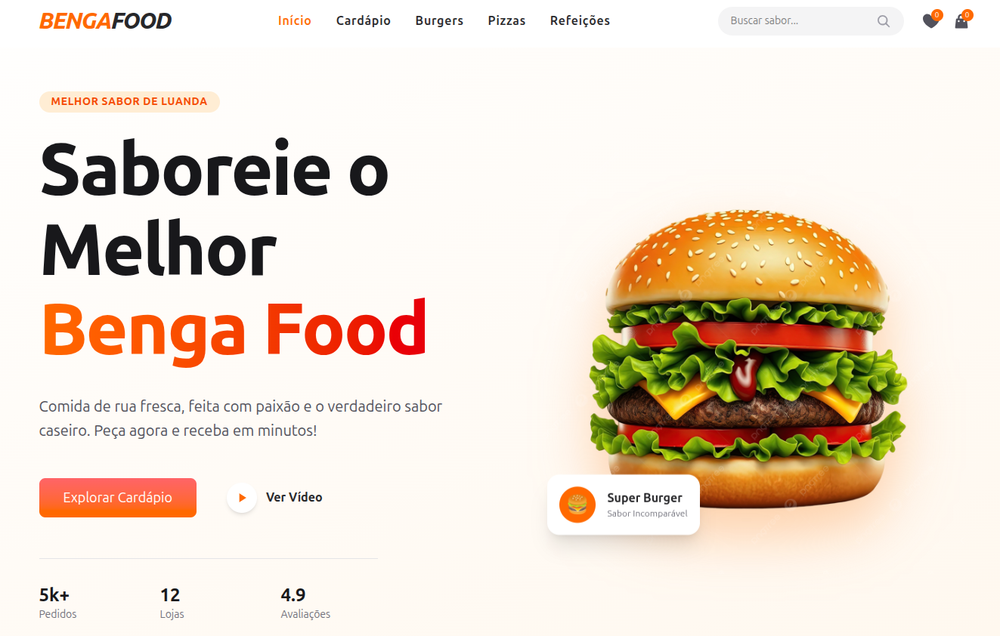

# 🍔 BengaFood

Bem-vindo ao **BengaFood**, um website moderno para um estabelecimento de fast food, desenvolvido com **React JS** e **Tailwind CSS**.

---

## Preview do Projeto



---

## Sobre o Projeto

O **BengaFood** é um site focado em proporcionar uma experiência agradável para os clientes, permitindo:

- Visualizar o menu completo  
- Explorar diferentes categorias de comidas  
- Ver detalhes dos produtos  
- Navegação rápida e responsiva  

---

## Tecnologias Utilizadas

- React JS  
- JavaScript (ES6+)  
- Tailwind CSS  

---

## Funcionalidades

- Listagem de produtos (hambúrguer, pizza, cachorro, refeições, etc.)  
- Filtro por categorias  
- Layout responsivo (mobile e desktop)  
- Interface moderna e intuitiva  

---

## Como Executar o Projeto

```bash
git clone https://github.com/seu-usuario/bengafood.git
cd bengafood
npm install
npm run dev